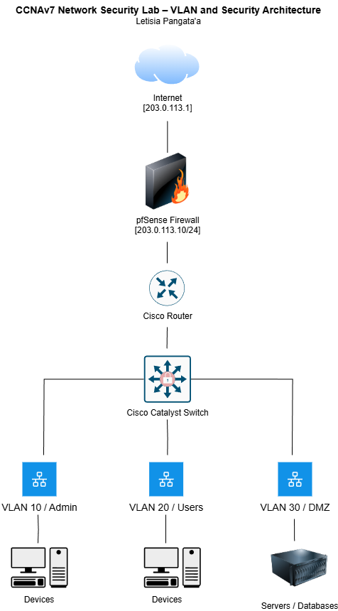

# 🔒 Network Security Lab – CCNAv7 Aligned (ALP)

This project is a hands-on network security lab designed to simulate secure network architecture and traffic monitoring. Inspired by my networking papers taken at Auckland University of Technology, it applies foundational CCNAv7 principles in a controlled lab environment using tools such as Cisco Packet Tracer, pfSense, and Wireshark.

---

## Project Overview

This lab demonstrates key concepts in network segmentation, perimeter defense, and security monitoring. It is designed to enhance both practical and theoretical understanding of network security in line with CCNA enterprise-level topics.

---

## Network Security Lab Topology (CCNAv7) Architecture

---

## Key Highlights

- **Network Segmentation Design**: Configured VLANs to isolate departments and reduce attack surfaces.
- **Firewall Rule Optimization**: Built and refined pfSense firewall rules to enforce least privilege access between VLANs.
- **Intrusion Detection Setup**: Integrated Snort IDS with pfSense to detect suspicious traffic patterns.
- **Traffic Analysis and Monitoring**: Captured and analyzed traffic with Wireshark to understand communication flows and identify anomalies.

---

## Technologies Used

| Technology         | Purpose                               |
|--------------------|----------------------------------------|
| Cisco Packet Tracer| Network topology simulation            |
| pfSense            | Open-source firewall and router        |
| Wireshark          | Network protocol analyzer              |
| VLAN Config        | Logical segmentation and isolation     |

---

## Repository Structure

| Folder        | Contents                                             |
|---------------|------------------------------------------------------|
| `/configs/`   | VLAN setup, pfSense firewall rules, IDS configs     |
| `/diagrams/`  | Network architecture and segmentation maps          |
| `/captures/`  | Sample `.pcap` traffic captures for analysis        |
| `/docs/`      | Lab setup guide and analysis reports                |

---

## Lab Scenario

This lab simulates a secure enterprise network with:

- **Three VLANs**: Admin, User, and DMZ
- **Router-on-a-stick configuration**
- **Firewall filtering inter-VLAN traffic**
- **IDS monitoring DMZ for abnormal behavior**

---

## Network Diagram

*Will add later*

---

## Sample Analysis

- Captured a brute-force SSH attack simulation on the DMZ
- Visualized suspicious packet spikes using Wireshark I/O graphs
- Correlated IDS alerts with firewall deny logs

---

## License

MIT License

---

## References

- [Cisco CCNA Security Official Guide]
- [pfSense Documentation](https://docs.netgate.com/pfsense/en/latest/)
- [Wireshark User Guide](https://www.wireshark.org/docs/wsug_html_chunked/)

---

## Disclaimer

This project was developed using a combination of publicly available learning resources, reference books, open source projects, and artificial intelligence tools. All efforts have been made to attribute and comply with relevant licenses. Contributions and insights from the broader open source and educational communities are gratefully acknowledged. This software is provided as-is, without warranty of any kind, express or implied. The author assumes no responsibility for any loss, damage, or disruption caused by the use of this code. It is intended for educational and experimental purposes only and may not be suitable for production environments.